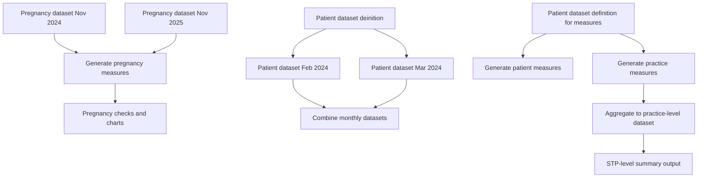

# ACT-PharmacyFirst-Protocol2-healthcare-usage

[View on OpenSAFELY](https://jobs.opensafely.org/repo/https%253A%252F%252Fgithub.com%252Fopensafely%252FACT-PharmacyFirst-Protocol2-healthcare-usage)

Details of the purpose and any published outputs from this project can be found at the link above.

The contents of this repository MUST NOT be considered an accurate or valid representation of the study or its purpose. 
This repository may reflect an incomplete or incorrect analysis with no further ongoing work.
The content has ONLY been made public to support the OpenSAFELY [open science and transparency principles](https://www.opensafely.org/about/#contributing-to-best-practice-around-open-science) and to support the sharing of re-usable code for other subsequent users.
No clinical, policy or safety conclusions must be drawn from the contents of this repository.

# Pipeline Overview and Data Flow
> Last update: 7 Apr 2026

The [current workflow](project.yaml) consists of three main components:

1. Pregnancy dataset and measures generation
2. Patient-level dataset aggregation and measures
3. Practice-level aggregation and summary (STP-level outputs)

The diagram below illustrates the overall data flow and dependencies between steps.



## Pregnancy dataset and measures generation
Please refer to [this issue](https://github.com/opensafely/ACT-PharmacyFirst-Protocol2-healthcare-usage/issues/1) for implementation details.

## Patient-level dataset aggregation and measures
There are two patient-level dataset definition:
- [dataset_definition_patients](analysis/dataset_definition_patients.py): used for generating monthly datasets for downstream analysis
- [dataset_definition_patients_measures](analysis/dataset_definition_patients_measures.py): for creating measures

#### Monthly data generation and aggregation
All monthly dataset generation steps rely on `dataset_definition_patients`.
This requires defining explicit actions in `project.yaml` for each month. These actions cannot be easily parameterised, so a separate action must be created for each specific month. 

*Steps*:

1. In `config.py`, define the `start` and `end` dates.

2. Run the following command to generate the monthly actions:
   ```bash
   python analysis/generate_project_action.py > project_test.yaml
   ```
3. Copy the generated monthly actions from project_test.yaml into project.yaml.
4. Update the combine_monthly_patient_gz step:
    - Modify the needs field so that it depends on all generated monthly datasets
    - The current configuration includes only two months as an example
    - When using `config.py`, this should be updated to include all months in the specified range


#### Patient-level measures
The `generate_patient_measures` step does not depend on the monthly datasets.
Instead, it relies on:
- `dataset_definition_patients_measures.py`
- `measures_patient.py`

## Practice-level aggregation and summary
Measures are first defined and calculated at the patient level. Each measure is computed over monthly intervals and grouped by practice, STP and region.
The output from the measure generation step is used to construct a practice-level dataset.
The practice-level dataset is then further aggregated to the STP level.
This enables comparison across STPs and supports higher-level reporting.

# About the OpenSAFELY framework

The OpenSAFELY framework is a Trusted Research Environment (TRE) for electronic
health records research in the NHS, with a focus on public accountability and
research quality.

Read more at [OpenSAFELY.org](https://opensafely.org).

# Licences
As standard, research projects have a MIT license. 
