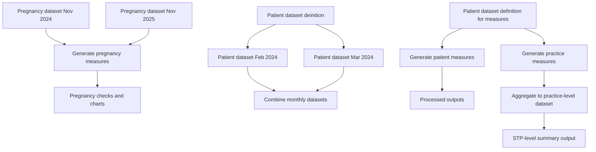

# ACT-PharmacyFirst-Protocol2-healthcare-usage

[View on OpenSAFELY](https://jobs.opensafely.org/repo/https%253A%252F%252Fgithub.com%252Fopensafely%252FACT-PharmacyFirst-Protocol2-healthcare-usage)

Details of the purpose and any published outputs from this project can be found at the link above.

The contents of this repository MUST NOT be considered an accurate or valid representation of the study or its purpose. 
This repository may reflect an incomplete or incorrect analysis with no further ongoing work.
The content has ONLY been made public to support the OpenSAFELY [open science and transparency principles](https://www.opensafely.org/about/#contributing-to-best-practice-around-open-science) and to support the sharing of re-usable code for other subsequent users.
No clinical, policy or safety conclusions must be drawn from the contents of this repository.

# Pipeline Overview and Data Flow
> Last update: 26 May 2026

> Files prefixed with `archive_...` represent older or deprecated scripts that are currently not used in the active analysis pipeline, but are retained for reference and development history.

The repository is organised around several core components:
- patient-level dataset generation
- practice-level aggregation and summary (STP-level outputs)
- validation workflows, including 
    - pregnancy variable checking and validation
    - several patient-level measures
    - snomed code occurrancence counting

These are reflected in the code blocks specified in the [current workflow](project.yaml).

The diagram below illustrates the overall data flow and dependencies between steps.



## Core patient-level dataset definitions

- [dataset_definition_patients](analysis/dataset_definition_patients.py): Main patient-level dataset definition used to generate monthly datasets for downstream analyses. Monthly datasets are generated separately for each study month.
- [dataset_definition_patients_measures](analysis/dataset_definition_patients_measures.py): Separate patient-level dataset definition used specifically for generating measures and validation outputs. This dataset is primarily used for measure generation, exploratory summaries and validation, and practice-level aggregation.

#### Monthly data generation and aggregation
Alongside the two main files,
- `analysis/generate_project_action.py`: Because monthly dataset generation cannot easily be parameterised within `project.yaml`, this script automatically creates the repetitive monthly actions in batch.
- `analysis/preprocess_combine_gz.py`: Utility script used to combine monthly compressed patient-level CSV outputs across the study period.

All monthly dataset generation steps rely on `dataset_definition_patients`.

Because these actions cannot easily be parameterised within `project.yaml`, separate actions must be created for each study month.

*Steps*:

1. In `config.py`, define the `start` and `end` dates.

2. Run the following command to generate the monthly actions:
   ```bash
   python analysis/generate_project_action.py > project_test.yaml
   ```
3. Copy the generated monthly actions from project_test.yaml into project.yaml.
4. Update the `combine_monthly_patient_gz` step:
    - Modify the needs field so that it depends on all generated monthly datasets
    - The current configuration includes only two months as an example
    - When using `config.py`, this should be updated to include all months in the specified range

## Practice-level aggregation and summary
Folder: `practice_variables`

Measures are generated at patient level and grouped by practice, STP and region over monthly intervals.

The resulting outputs are then aggregated to:
- practice-level datasets;
- STP-level summaries;
- regional summaries.

These outputs support descriptive comparisons across practices and regions.

## Pregnancy dataset and measures generation
Folder: `check_pregnancy_variables`

Please refer to [this issue](https://github.com/opensafely/ACT-PharmacyFirst-Protocol2-healthcare-usage/issues/1) for implementation details.

## Patient-level measures (for validation)
Folder: `validation`

This folder contains several validation workflows used to check:
- population structure;
- consultation counting;
- consultation mode classification;
- eligibility definitions.

Each validation workflow typically includes a measure definition file and a corresponding `process_...` Python script for summarising outputs. Some processing scripts also generate CSV summaries and plots for validation purposes.

The current `project.yaml` configuration mainly includes validation actions for October and/or November 2025.

## SNOMED code counting (for validation)
Folder: `validation_snomed`

This folder contains workflows used to examine SNOMED coding patterns within GP consultations related to PF conditions. Details are noted in the [README](analysis/validation_snomed/README.md) file.


# About the OpenSAFELY framework

The OpenSAFELY framework is a Trusted Research Environment (TRE) for electronic
health records research in the NHS, with a focus on public accountability and
research quality.

Read more at [OpenSAFELY.org](https://opensafely.org).

# Licences
As standard, research projects have a MIT license. 
